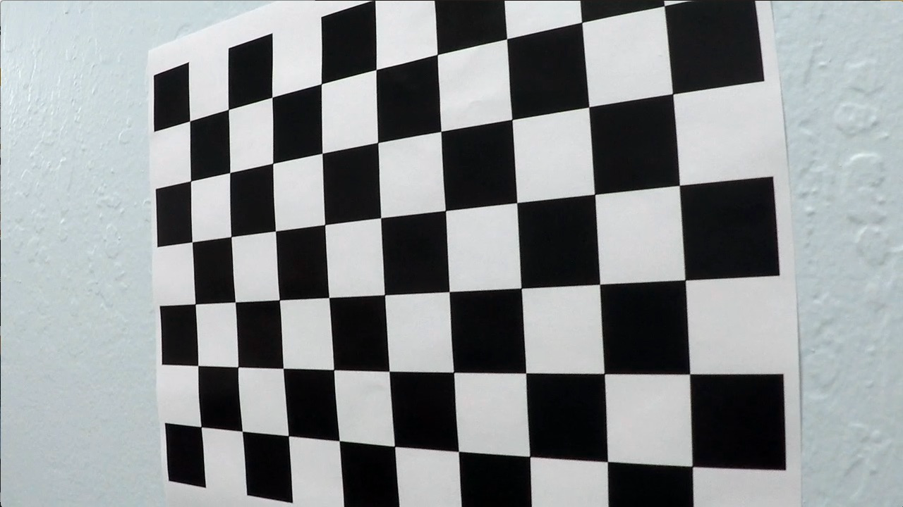
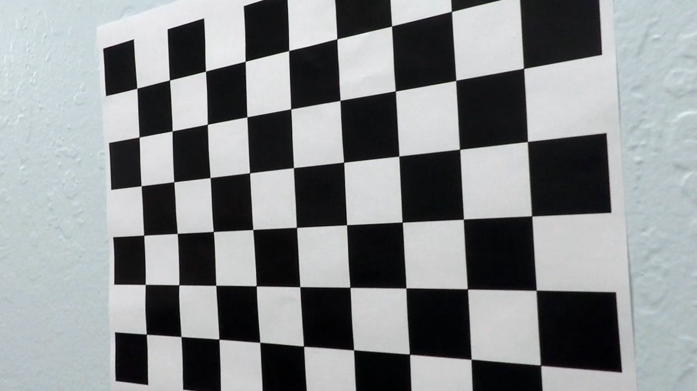
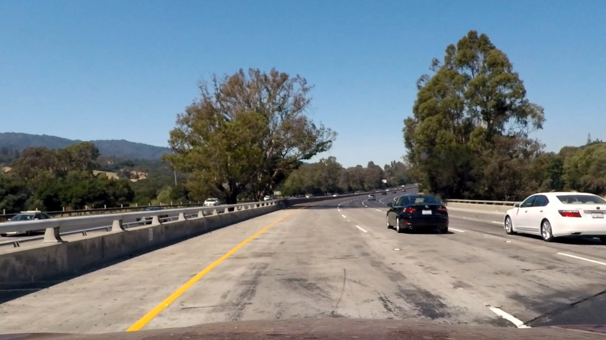
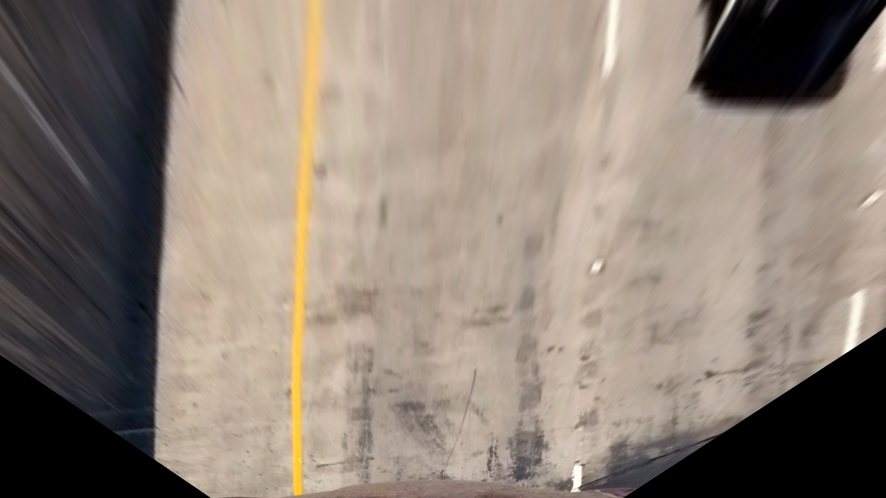
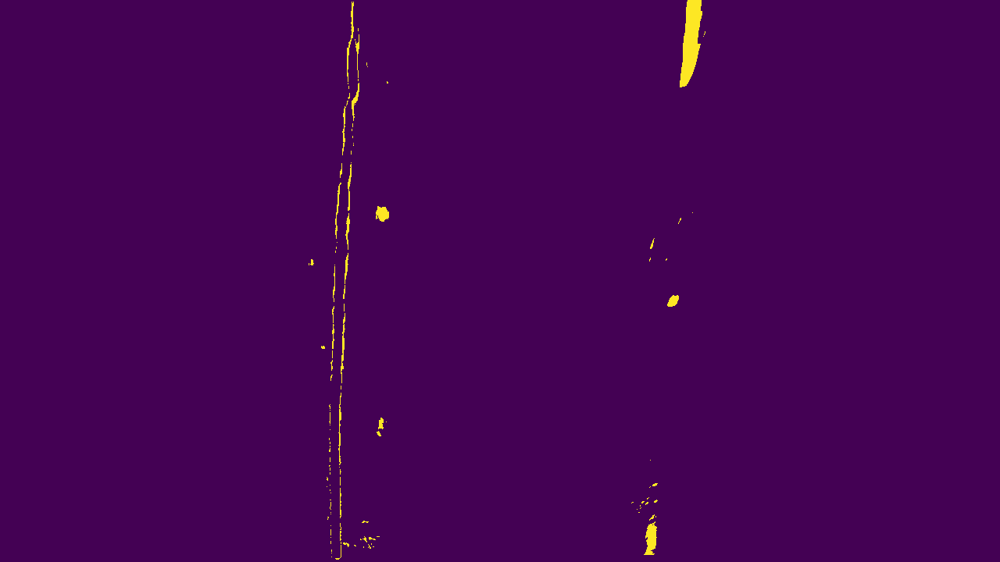
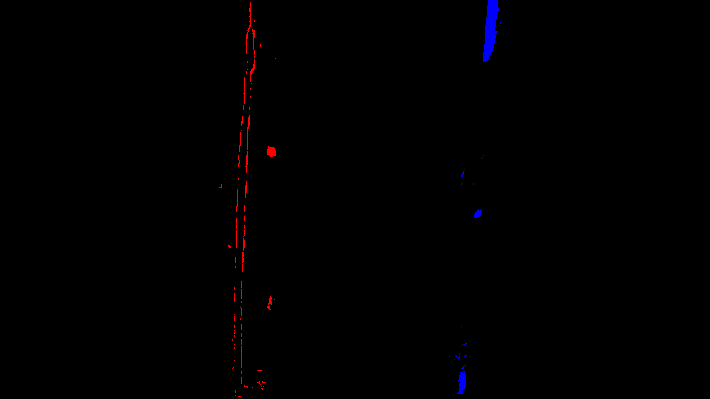
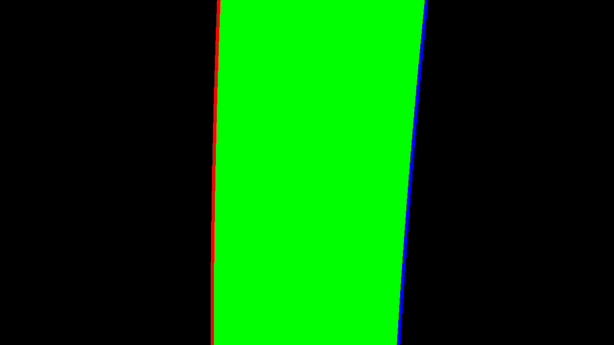
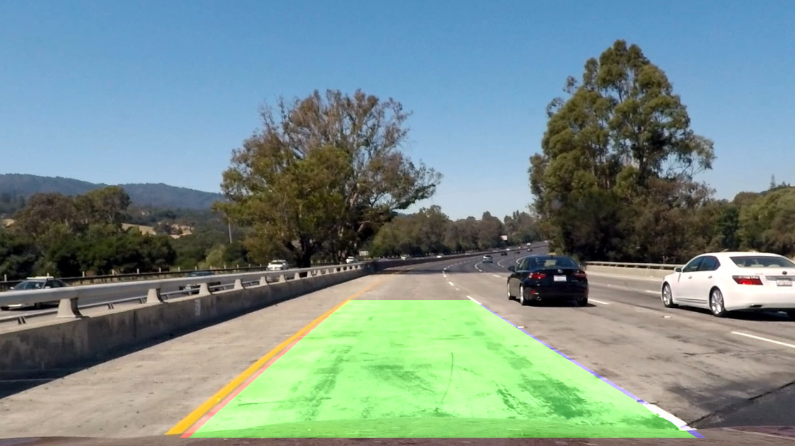

## Advanced Lane Finding
[](http://www.udacity.com/drive)
  

Image processing pipeline
---
Following sequence describes the image processing pipeline used in the project.
1. Camera Calibration
2. Undistorting input frames
3. Region of Interest mask
4. Perspective transform
5. Lane detection by Thresholding using colour spaces
6. Lane calculation (polynomial, curvature, distance off center)
7. Inverse Perspective Transform
8. Overlay

Code
---
The entire code can be found in Advanced-Lane-Finding.ipynb. It is divided into 4 parts. 
1. Utility functions for carrying out various tasks like thresholding, separating color channels, running pipeline etc.
2. Classes (Camera, LaneExtractor, Pipeline) - These classes carry out the 3 important tasks in the pipeline. It will be detailed below.
3. Generating outputs for Rubrik
4. Running pipeline for the video

Camera calibration
---
```python
calibrated_camera = Camera(glob.glob('camera_cal/calibration*.jpg'), (9,6))
```

We use a class Camera to handle camera calibration. For the constructor it takes as input a set of image paths and pattern size as shown above. Here, the pattern size is 9x6 and we use glob to send a set of paths that follow a pattern. 

The constructor calls the calibrate method in the class that takes the above set of images and uses opencv functions `cv2.findChessboardCorners` to find the corner pixels. Once we have collected the corner coordinates for all the calibration images (usually 20 or more for best results) we run `cv2.calibrateCamera` function to get the distortion coefficients and camera matrix. 

For some cases the above step fails when the chessboard doesn't have the expected pattern size. We save them for demonstrating calibration.

#### Example:
##### Distorted Chessboard Image:


##### Undistorted Chessboard Image


As you can see the fringing towards the corners are corrected. Another real life example:
##### Distorted Image:


##### Undistorted Image


Perspective transformation
---
A perspective transform maps the points in a given image to different, desired, image points with a new perspective. For our case we are interested in the bird's eye view to calculate our relative position in the road. This also lets us calculate lane curvature and our position with respect to lane.

We have to select 4 coordinates in the original image and their expected coordinates in the warped image. This is like a hyperparameter tuning. It seems like choosing 4 points closer to the camera is better because at that part the road can be assumed straight. Bad parameters caused the warped image to be hazy which caused more issues during lane detection.

After that we can use OpenCV function `cv2.getPerspectiveTransform` to find the perspective matrix. Then we use this matrix to warp perspective using the function `cv2.warpPerspective`.

```python
src = np.float32([[312,707],[1131,707],[897,575],[457,575]])
dst = np.float32([[450,720],[830,720],[830,550],[450,550]])
M = cv2.getPerspectiveTransform(src,dst)
warped = cv2.warpPerspective(img, M, img_size)
```
The actual implementation uses an additional parameter `inv` to handle inverse Perspective Transform in the same function.

#### Example:
##### Original Image:


##### Warped Image


Lane Detection
---
Since we are using thresholding techniques we first removed unnecessary parts of the image using a region of interest mask like the one we had used the last time. Then we use thresholding using L and S channel from HLS color space and B channel from LAB color space using normalization to diminish the effect of lighting condition. B in the LAB color space and S in HLS are most effective in detecting yellow lines and L for white.

```python
x1 = singlechannel_threshold((extract_lab(img)[2]) , thresh = (0,200), normalize = True) #detects yellow line
x2 = singlechannel_threshold((extract_hls(img)[1]) , thresh = (200,255), normalize = True) #detects white line
x3 = singlechannel_threshold((extract_hls(img))[2] , thresh = (80,200), normalize = True) #detects yellow line
```
Since these thresholds were sufficiently good we refrained from using sobel filter which added noise if there are imperfections in the road. It can be probably be tuned better.

#### Example:
##### Original Image:


##### Binary Image


Implement sliding windows and fit a polynomial
---
Using the binary image we just calculated we calculate a histogram to find the starting points of the lane lines. We use sliding window algorithm as described in the lectures to find the points that are part of edge of the lane. Using the points we fit a polynomial of the 2nd order using `np.polyfit` function.

This is implemented in the LaneExtractor class. `find_lane_pixels(self, binary_warped)` runs the sliding window algorithm to calculate the candidate points for left lane `leftx, lefty` and right lane `rightx, righty`.

We also tested searching around polynomial technique to avoid using sliding windows since it is expensive. It worked perfectly fine for the project_video but the results weren't that great for the challenge_video. This is in part due to imperfect lane detection algorithm which needs to be improved further to make sure we detect the path always.

Once we have the points, we fit a 2nd order polynomial for each lane. Then we calculate the value for each y coordinate and draw a line between left and right lane to get the lane trace. 

```python
self.left_fit = np.polyfit(lefty, leftx, 2)
self.right_fit = np.polyfit(righty, rightx, 2)
```

Once we have the polynomials we can use the derivatives method to find the radius of curvature. We also use pixel to metres mapping to give real world data. We also calculate the relative position of car with respect to lane here.


```python
ym_per_pix = 20/720
xm_per_pix = 3.7/380

ploty = np.linspace(0, self.height-1, self.height)
y_eval = np.max(ploty)

try:
    left_fit_cr = np.polyfit(lefty*ym_per_pix, leftx*xm_per_pix, 2)
    right_fit_cr = np.polyfit(righty*ym_per_pix, rightx*xm_per_pix, 2)
except:
    left_fit_cr = (1,1,1)
    right_fit_cr = (1,1,1)
        
self.left_curverad = ((1 + (2*left_fit_cr[0]*y_eval*ym_per_pix + left_fit_cr[1])**2)**1.5) / np.absolute(2*left_fit_cr[0])
self.right_curverad = ((1 + (2*right_fit_cr[0]*y_eval*ym_per_pix + right_fit_cr[1])**2)**1.5) / np.absolute(2*right_fit_cr[0])
        
self.left_offcentre = np.absolute((self.width // 2 - left_fit_cr[-1]) * xm_per_pix)
self.right_offcentre = np.absolute((self.width // 2 - right_fit_cr[-1]) * xm_per_pix)
```

#### Example:
##### Binary Image:


##### Lane Identification Image


##### Lane tracing:


Inverse Perspective Transform and overlay
---
We perform inverse perspective transform and use the OpenCV function `cv2.addWeighted` to overlay the lanes to show the lanes in the final output. To show data we have made a separate function that adds radius of curvature and offcenter distance to the displaying frames.

#### Example:
##### Original Image:


##### Lane Identified


Reflection
---
The above method worked perfectly for the project video, okayish for the challenge video and horribly in the harder challenge. The easier way to optimize was to use different sets of parameters but that isn't advisable for real world since we can use only 1 set of hyperparameters. May be better tuning for lane detection etc.

The output videos are project_video_output.mp4, challenge_video_output.mp4 and harder_challenge_video.mp4.

Another noticeable thing is that the processing speed is slower and in real world application that won't be feasible.
